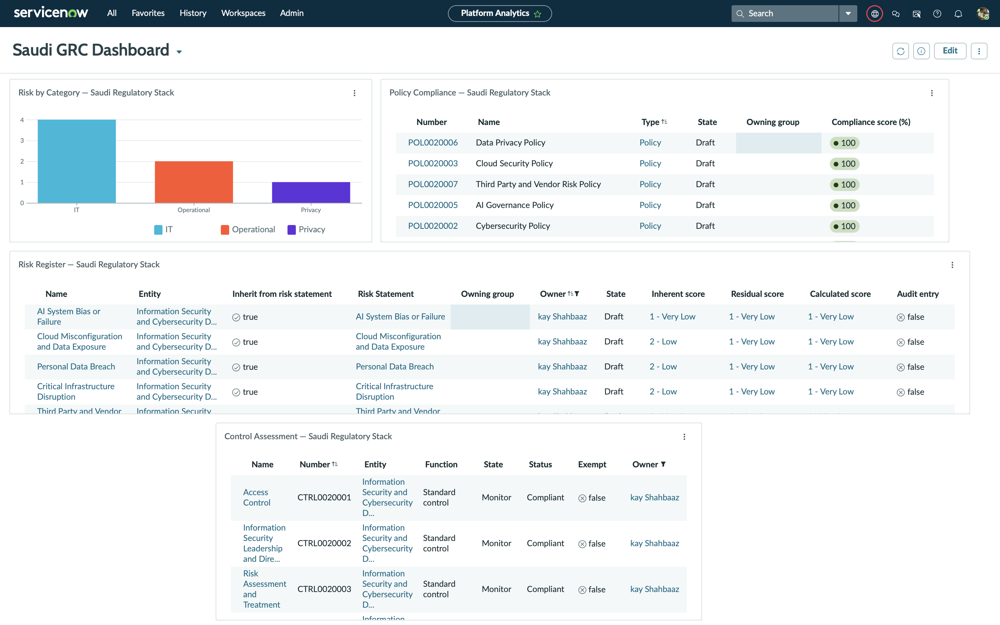

# ServiceNow IRM — Saudi Regulatory GRC Implementation

A full end-to-end ServiceNow Integrated Risk Management (IRM) implementation scoped to the Saudi Arabian regulatory and international compliance landscape, built on a Personal Developer Instance (PDI).

Every record was configured from scratch — frameworks loaded citation by citation, policies mapped to real control objectives, risks scored using a quantitative model, and a live executive dashboard assembled across all layers.

---

## What Was Built

| Layer | Detail | Count |
|---|---|---|
| Regulatory Frameworks | Authority Documents loaded as the citation backbone | 7 |
| Framework Citations | Controls, subdomains, and domains mapped per framework | 579 |
| Policies | Organisational policies linked to frameworks | 7 |
| Control Objectives | Operational commitments bridging policy to framework | 21 |
| Controls | Assessed controls linked to control objectives | 23 |
| Risk Framework | Saudi Regulatory Risk Framework | 1 |
| Risk Statements | Risk definitions scoped to the Saudi regulatory context | 7 |
| Risk Records | Risks scored against a business entity using SLE × ARO = ALE | 7 |
| Reports | List and chart reports built against live GRC tables | 4 |
| Dashboard | Executive GRC dashboard aggregating all views | 1 |

---

## Phase 1 — Regulatory Frameworks

Seven authority documents loaded into ServiceNow GRC as the foundation for all policies, control objectives, and controls.

**Saudi National Frameworks**

| Framework | Record | Citations | Method |
|---|---|---|---|
| NCA ECC-2:2024 — Essential Cybersecurity Controls | AD0020001 | Manual build | Domain → Subdomain → Control |
| NCA CCC-2:2024 — Cloud Cybersecurity Controls | AD0020002 | Manual build | Domain → Subdomain → Control |
| NCNICC-1:2025 — Critical Infrastructure Cybersecurity Controls | AD0020003 | 61 | CSV import |
| SAMA CSF — Cyber Security Framework | AD0020004 | 89 | CSV import |
| PDPL — Personal Data Protection Law | AD0020007 | 84 | CSV import |

**International Frameworks**

| Framework | Record | Citations | Method |
|---|---|---|---|
| ISO/IEC 27001:2022 — Information Security Management | AD0020008 | 198 | CSV import |
| ISO/IEC 42001:2023 — AI Management Systems | AD0020009 | 48 | CSV import |

**Total: 579 citations across 7 frameworks**

NCA ECC and NCA CCC were built manually — every domain, subdomain, and control entered directly into ServiceNow — to demonstrate full platform depth beyond import. The remaining five frameworks were loaded via CSV import with a staging table and transform map, which is the standard production approach for large frameworks.

---

## Phase 2 — Policies and Control Objectives

Seven organisational policies built, each mapped to its primary regulatory framework. Each policy carries three Control Objectives — the operational layer between a framework requirement and a control assessment.

| Policy | Framework | Control Objectives |
|---|---|---|
| Information Security Policy | ISO 27001 | Access Control · IS Leadership and Direction · Risk Assessment and Treatment |
| Cybersecurity Policy | NCA ECC | ECC-D1 Governance · ECC-D2 Defense · ECC-D3 Resilience |
| Cloud Security Policy | NCA CCC | CCC-D1 Governance · CCC-D2 Controls · CCC-D3 Resilience |
| Critical Infrastructure Protection Policy | NCNICC | NCNICC-D1 Governance · NCNICC-D2 Controls · NCNICC-D3 Resilience |
| AI Governance Policy | ISO 42001 | 42001-D1 Governance · 42001-D2 Risk · 42001-D3 Controls |
| Data Privacy Policy | PDPL | PDPL-D1 Governance · PDPL-D2 Rights · PDPL-D3 Processing |
| Third Party and Vendor Risk Policy | SAMA CSF | SAMA-D1 Governance · SAMA-D2 Requirements · SAMA-D3 Monitoring |

All 7 policies active. All 21 control objectives active and linked.

---

## Phase 3 — Risk Register

**Risk Framework:** Saudi Regulatory Risk Framework (RFR0001001)  
**Entity Assessed:** Information Security and Cybersecurity Division (Business Unit)

Seven risk statements defined and loaded, covering the primary threat categories for a Saudi-regulated organisation.

| Risk Statement | Category |
|---|---|
| Unauthorized Access to Critical Systems | IT |
| Cloud Misconfiguration and Data Exposure | IT |
| Personal Data Breach | Privacy |
| Third Party and Vendor Failure | Operational |
| Critical Infrastructure Disruption | Operational |
| AI System Bias or Failure | IT |
| Information Security Incident | IT |

---

## Phase 4 — Risk Scoring

Each risk scored using the quantitative SLE × ARO = ALE model. ServiceNow maps the resulting ALE to qualitative risk bands automatically.

```
SLE  ×  ARO  =  ALE
Single Loss Expectancy × Annualised Rate of Occurrence = Annualised Loss Expectancy
```

Every risk record carries both an **Inherent score** (pre-control) and a **Residual score** (post-control), showing the impact of controls on risk reduction.

| Risk | Inherent SLE | Inherent ARO | Residual SLE | Residual ARO |
|---|---|---|---|---|
| Unauthorized Access to Critical Systems | 500,000 | 3 | 150,000 | 1 |
| Cloud Misconfiguration and Data Exposure | 400,000 | 4 | 100,000 | 2 |
| Personal Data Breach | 600,000 | 2 | 200,000 | 1 |
| Third Party and Vendor Failure | 300,000 | 3 | 100,000 | 1 |
| Critical Infrastructure Disruption | 1,000,000 | 2 | 300,000 | 1 |
| AI System Bias or Failure | 250,000 | 3 | 75,000 | 1 |
| Information Security Incident | 450,000 | 4 | 150,000 | 2 |

---

## Phase 5 — Control Assessment

23 controls assessed across all 7 frameworks — 21 created via background script (GlideRecord), 2 manually. Each control is linked to a Control Objective and assessed against its framework citations.

| Record | Control | Framework |
|---|---|---|
| CTRL0020001 | Access Control | ISO 27001 |
| CTRL0020042 | Cybersecurity Governance and Risk Management | NCA ECC |
| CTRL0020043 | Third Party Risk Governance and Oversight | SAMA CSF |

> **Note on Compliance Scores:** All controls are set to Monitor state with Compliant status to demonstrate the scoring mechanism end-to-end. In a production environment, scores would reflect actual attestation cycles and typically land in the 65–80% range. This is a demo PDI — the implementation shows the platform configuration and workflow, not a live compliance posture.

---

## Phase 6 — Reports and Dashboard

**4 reports built against live ServiceNow tables:**

| Report | Type | Table |
|---|---|---|
| Risk Register — Saudi Regulatory Stack | List | sn_risk_risk |
| Risk by Category — Saudi Regulatory Stack | Bar chart | sn_risk_risk |
| Policy Compliance — Saudi Regulatory Stack | List | sn_compliance_policy |
| Control Assessment — Saudi Regulatory Stack | List | sn_compliance_control |

**Saudi GRC Dashboard — 4 widgets:**

The dashboard aggregates all four reports into a single executive-facing view — risk distribution by category, policy compliance status, full risk register with inherent and residual scores, and control assessment scoped to the Information Security and Cybersecurity Division.



---

## Screenshots

```
screenshots/
├── 00-pdi-instance-activated/
├── frameworks/
│   ├── nca-ecc/
│   ├── nca-ccc/
│   ├── ncnicc/
│   ├── sama-csf/
│   ├── pdpl/
│   ├── iso-27001/
│   └── iso-42001/
├── citation-records/
├── policies/
├── risk-register/
├── controls/
├── reports/
└── dashboard/
    └── saudi-grc-dashboard.png
```

---

## Why This Matters for Saudi GRC

Saudi Arabia operates one of the most layered regulatory environments in the region. Organisations must simultaneously satisfy NCA ECC (mandatory cybersecurity baseline), NCA CCC (cloud controls), NCNICC (critical infrastructure), SAMA CSF (financial sector), PDPL (data protection), ISO 27001 (international baseline), and ISO 42001 (AI governance).

This implementation demonstrates the ability to load and manage all seven frameworks inside a single GRC platform, maintain full policy-to-citation traceability, score risks quantitatively, run compliance assessments, and deliver executive-level reporting — the core skill set for a ServiceNow IRM implementation engagement in the Saudi market.

---

## Platform

| | |
|---|---|
| Platform | ServiceNow IRM (Integrated Risk Management) |
| Instance | Personal Developer Instance — Australia release (latest) |
| Instance URL | dev383370.service-now.com |
| Modules | Policy and Compliance Management · Risk Management · Authority Document Management · Reporting · Dashboards |

---

## Author

**Kay Shahbaaz**  
Cybersecurity GRC Analyst & Auditor and AI Governance Researcher with hands-on experience across NCA ECC, NCNICC, SAMA CSF, PDPL, ISO 27001, and ISO 42001.

[GitHub](https://github.com/kayShahbaaz)
